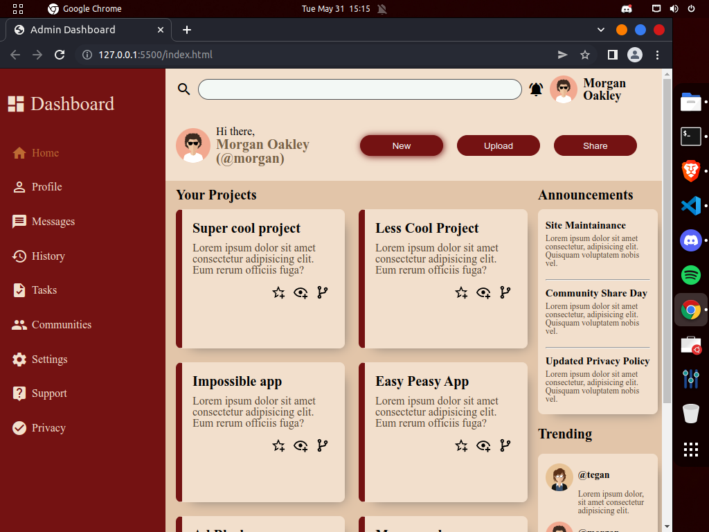

# Admin Dashboard Project

# What is Admin Dashboard
Admin Dashbaord is one of the project on TheOdinProject. The objective of this project is to practice Grid by creating a dashboard layout.

# What did I learn?
- How to use Grid
- How to create layout with grids
- Differnet Grid properties
    - grid-template-column
    - grid-template-row
    - gap
    - Many more
- How to use different Css selectors
    - Simple selectors   
    - Combinator selectors 
    - Pseudo-class selectors
- How to use a color palette

# Link
https://muditchoudhary.github.io/admin-dashboard/

# Icons, Images, Svg Images, Color Pellate Credits
- Svg avatars from [Svg Repo](https://www.svgrepo.com/)
- Icons from [Material Design Icons](https://materialdesignicons.com/) & [Google Icons](https://www.w3schools.com/icons/google_icons_intro.asp)
- Color Scheme from [Colormind.io](http://colormind.io/bootstrap/)